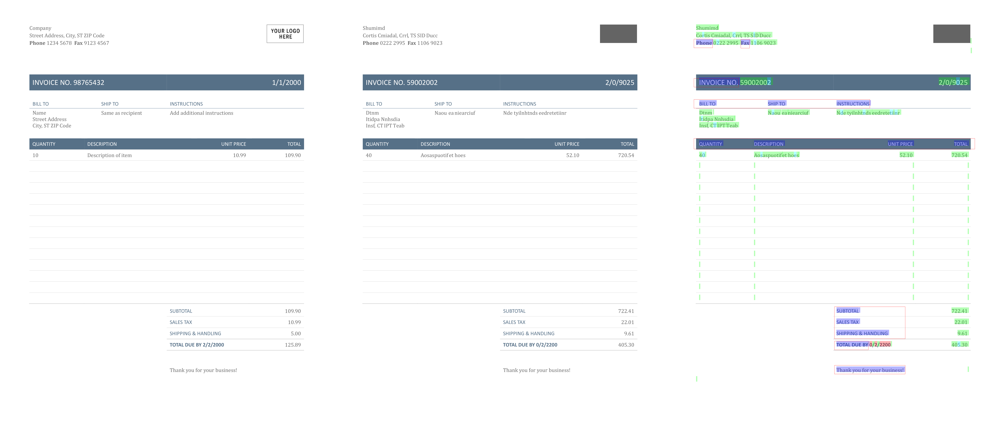

# PDF Anonymizer

This script takes PDF documents and randomizes the characters within to produce an anonymized version with visual similarities to the original.
Characters are substituted with random characters of the same shape, font style, height, and weight. The _approximate_ width of words is maintained to limit unnatural white space in the output.
Substitutions are made within three substitution groups to maintain the shape of text:
- lowercase letters
- uppercase letters
- numbers

Punctuation and other text is left unchanged.
Images are also masked with a grey box by default (can be disabled).

## Requirements
- MuPDF Tools.

On Ubuntu:
```
sudo apt install mupdf-tools
```

On MacOS:
```
brew install mupdf-tools
```

## Usage
```
mutool run anonymize.js input.pdf output.pdf [highlightedOutput.pdf] [whitelistZones.json] [maskImages=1] [dpi=300]
```

This will take input.pdf and randomize all the characters within, and produce output.pdf.

Optionally, if we specify a third argument, a highlighted output PDF will be generated. This file shows which regions have been changed in the output file using different colors. See below for a description of each of the colors.

A fourth argument, if specified, is a JSON file containing a list of zones that have been white-listed. Characters within white-listed zones are not randomized. The format of this file should be as follows:
```
[
    {
        "page_idx": 0,
        "x1": 0.08169934640522876,
        "x2": 0.13790849673202615,
        "y1": 0.0907449494949495,
        "y2": 0.1109469696969697
    },
    {
        "page_idx": 0,
        "x1": 0.22230392156862747,
        "x2": 0.24874183006535952,
        "y1": 0.09154040404040405,
        "y2": 0.11174242424242424
    },
    …
]
```
Each of the zones is represented as two (x, y) coordinates. Each x, y coordinate is specified as a ratio of the page width/height respectively.
Each zone also specifies which page it applies to, with 0 being the first page.

The fifth argument specifies whether or not images should be masked. 

The sixth argument determines the image resolution in the output PDF.

If you wish to specify an optional argument without specifying a previous optional argument, set the previous argument to an empty string ('').
For example, if you wish to disable image masking without specifying any of the earlier options, run:
```
mutool run anonymize.js input.pdf output.pdf '' '' 1
```

## Example
```
mutool run anonymize.js example/invoice.pdf example/invoice_anonymized.pdf example/invoice_highlighted.pdf example/invoice_whitelist.json
```

(click to view full-resolution image)

On the left, we have the original PDF. In the middle, the result of the anonymization. On the right, we have the highlighted output file, showing us the regions of the page that were modified:
- Green shows characters that were randomly substituted.
- Turquoise shows characters that were randomly substituted to the exact same character as in the original document.
- Blue shows characters that were not substituted because they were within white-listed zones—red outlines show the white-list zones.
- Red shows characters that could not be adequately randomised due to the lack of characters in the same font.
- Orange shows characters that were not substituted and are not punctuation.

## Limitations
- Vector graphics embedded within the PDF as drawing commands are not replaced.
- The output PDF file is a completely new PDF containing a single _image_ representation of each page.
- Non-ASCII characters are not substituted.
